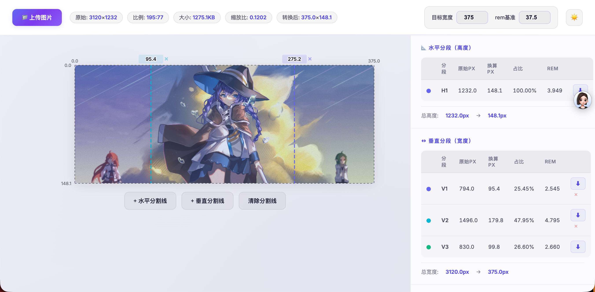
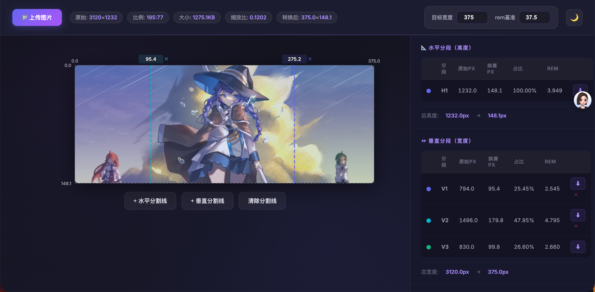

# imgAspect

一个纯前端、单文件的图片比例换算工具。它可以把设计稿图片拆分成多个分段，实时对比尺寸，并换算到目标宽度、百分比和 `rem`。




## GitHub Pages

演示地址：`https://sergio221110.github.io/imgAspect/`

## 功能

- 支持点击、拖拽、粘贴上传图片
- 自动读取原始尺寸、比例和文件大小
- 支持设置目标宽度和 `rem` 基准
- 自动生成图片边界线，方便分段计算
- 可拖拽分割线，实时调整每一段数据
- 数据面板显示原始 `px`、换算 `px`、百分比和 `rem`
- 支持删除自定义分割线
- 支持裁切导出图片分段
- 深色 / 浅色主题切换

## 核心公式

```text
scale = targetWidth / naturalWidth
convertedPx = originalPx × scale
percent = convertedPx / convertedDimension × 100
rem = convertedPx / remBase
```

## 本地运行

直接在浏览器中打开 `index.html` 即可使用，无需安装依赖。

## 为什么这个仓库有价值

- 无运行时依赖
- 一个 HTML 文件就是核心应用
- 使用 SVG 叠加层绘制分割线和标签
- 保存原始像素坐标，缩放后不会影响计算
- 边界线固定存在，不可删除

## 许可证

MIT
